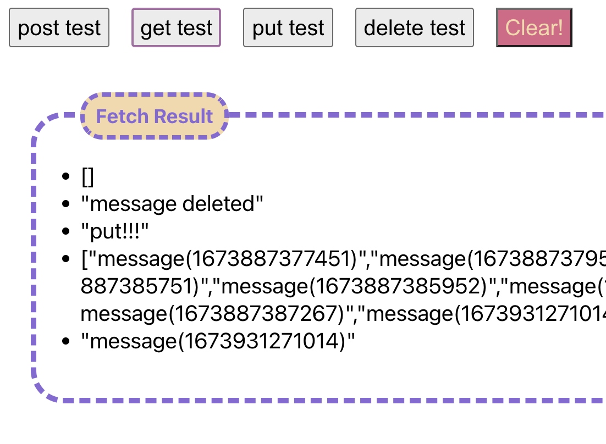
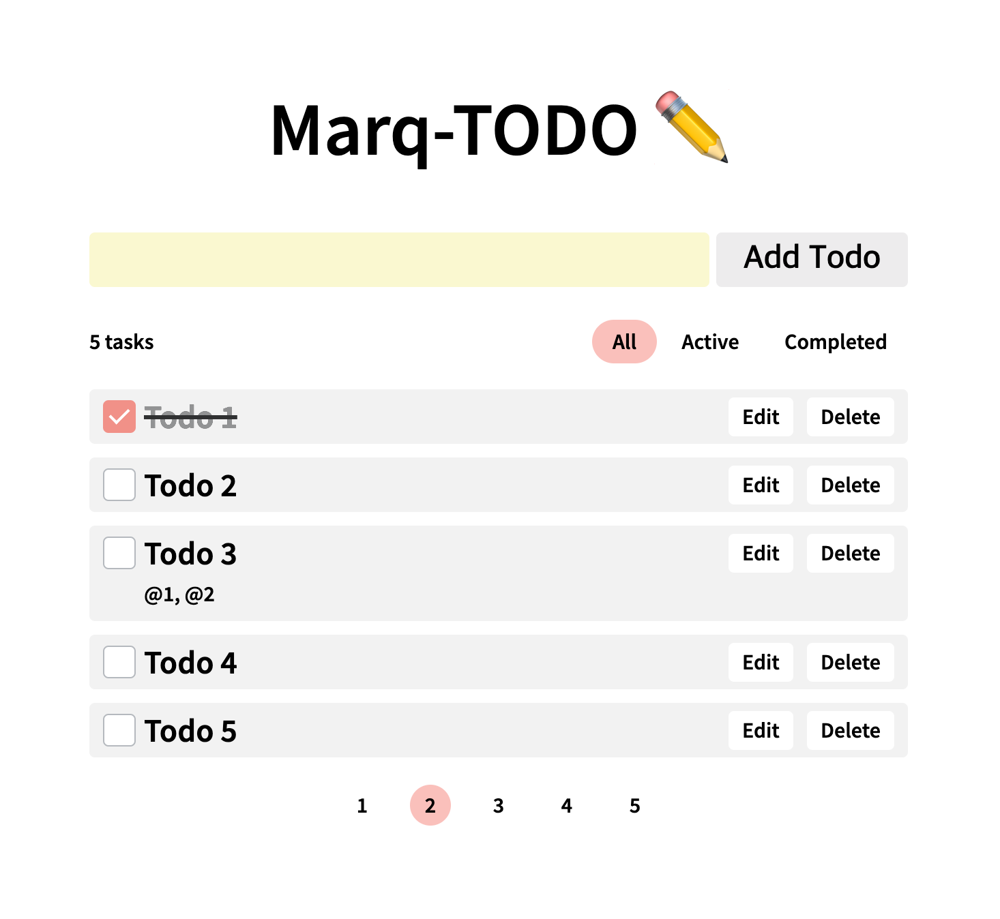

# 마크비전 기술면접 과제 (Marq-TODOS)

## 프로젝트 구성

- 프로젝트는 CRA(https://create-react-app.dev/) + Typescript(https://www.typescriptlang.org/) + MSW(https://mswjs.io/)로 구성되어 있습니다. 
- 위의 구성 외에 추가하고 싶은 패키지(ajax 도구, 상태관리 도구, 등)는 추가해도 좋습니다. 
- 단, html+css에 대한 숙련도를 볼 수 있도록  antd, mui, 등의 ui 라이브러리는 제외하고 직접 ui를 구현해주세요.
- 원하는 패키지 관리자를 이용하여 의존성을 설치해주세요. `yarn` 또는 `npm install` 등등
- 원하는 패키지 관리자를 이용하여 start 명령어를 실행해주세요. `yarn start` 또는 `npm run start` 등등
- 실행에 성공했다면 CRA 기반의 웹앱이 실행되고 아래 첨부 이미지와 같이 mock api 구현체를 간단히 테스트해볼 수 있는 ui를 제공하고 있습니다.

## 과제 요구사항

다음의 기능을 갖고있는 todo 앱을 개발해주세요.

- 사용자는 문자열로 된 todo를 추가 할 수 있다.
- 작성일, 최종수정일, 내용, 참조하고 있는 todo들의 id가 표시되어야 한다. (예시 참고)
- 사용자는 todo를 완료 또는 미완료로 상태변경을 할 수 있다.
- todo는 다른 todo들을 참조할 수 있다.
- 참조하고 있는 todo들이 모두 완료 상태가 아니라면 todo를 완료할 수 없다.
- 사용자는 todo 목록을 조회할 수 있다.
- 사용자는 todo를 수정할 수 있다.
- 사용자는 todo를 삭제할 수 있다.

다음의 기능을 구현하시면 추가 점수를 획득할 수 있습니다.
- 페이지네이션! 페이지네이션은 무한 스크롤로 구현하셔도 좋습니다.
- 프로젝트-root/src/mocks/handlers.ts 에 mock api를 구현하고 todo 앱이 해당 api를 통해서 작동하도록 구현.

## 구현 예시 이미지
  
- todo 1은 완료 상태이다. 
- todo 3은 todo 1, 2를 참조하고 있다. 
- todo 3은 todo 1, 2가 완료되기 전에는 완료되면 안 됨. 
- 예시 이미지에는 없지만 개발 스펙에 명시된 것 처럼 작성일과 최종수정일이 출력되도록 구현해주세요.

## 기타 요구사항
- react 기반 웹앱으로 개발 
- db 사용과 관련하여 제약 없음. 메모리에 적당히 저장하던가 파일로 저장해도 OK~
- 유닛테스트 작성 시 가산점 
- 요구사항에 정의돼 있지 않은 스펙들(투두 수정하기, 삭제할 때의 제약사항, 등등)은 일반적인 투두 앱들과 비슷하게 구현하시고 면접 때 관련된 내용을 설명해주시면 됩니다. 
- 재직 중이어서 시간이 부족한 점, 때문에 모든 스펙을 구현하기 어려운 점, 등은 잘 알고있고 과제물을 검토할 때 충분히 감안하겠습니다.
- 단, 구현한 기능은 모두 정상작동되고 시연해주실 수 있도록 잘 마무리 해주세요.

## 결과물 제출
- 소스코드를 zip으로 압축해서 첨부하거나 github, bit bucket, 등 원격 저장소에 업로드한 후 url을 이메일 회신을 통해 공유해주시면 됩니다.
- 반드시 readme.md 등에 빌드 및 실행 방법을 명시해주세요.
- 개발기간은 일주일입니다. 예를 들어 과제물을 알려드린 시간이 목요일이었다면 다음날인 금요일부터 개발을 시작하는 것으로 보고, 차주 금요일 오전까지 개발한 내용을 공유해주시면 됩니다.
